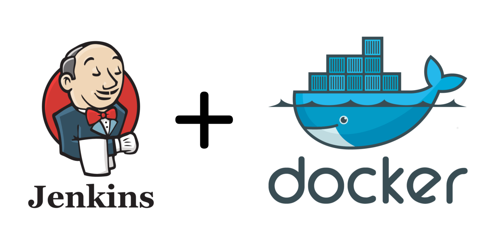

# Jenkins image with access to the host’s docker engine



## Usage

```
docker run -p 8080:8080 -p 50000:50000 -v /var/run/docker.sock:/var/run/docker.sock -v jenkins_home:/var/jenkins_home mdobak/docker-jenkins:latest
```

Or you can use docker-compose:

```
version: '3.2'
services:
    jenkins:
        image: mdobak/docker-jenkins:latest
        ports:
           - "8080:8080"
           - "50000:50000"
        volumes:
           - "/var/run/docker.sock:/var/run/docker.sock"
           - "jenkins_home:/var/jenkins_home"
        restart: always
```

It is necessary to mount host's docker socket into container, otherwise docker won't work inside our container.

NOTE: This image is not "docker-in-docker" image. Docker engine inside container will have access to the host’s docker engine!

## Installing plugins

To install plugins you can create custom Dockerfile:

```
FROM mdobak/docker-jenkins:latest
  
RUN install-plugins.sh \
    blueocean \
    docker-workflow
```

Or you can use run command on running container:

```
docker run CONTAINER_ID install-plugins.sh blueocean docker-workflow
```

## Documentation

You can find more information about jenkins image in official documentation: https://github.com/jenkinsci/docker/blob/master/README.md